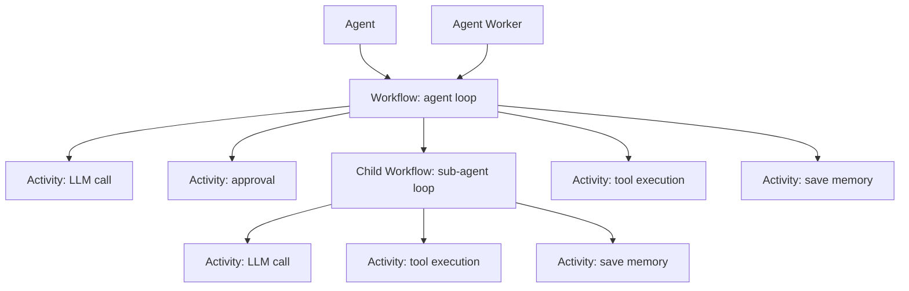

# Agent SDK for Go - Temporal-first

**Build durable, production-grade AI agents in Go** — tools, MCP, human approvals, and sub-agent delegation.

[](https://github.com/agenticenv/agent-sdk-go/actions)
[](https://github.com/agenticenv/agent-sdk-go/releases)
[](https://pkg.go.dev/github.com/agenticenv/agent-sdk-go)
[](https://goreportcard.com/report/github.com/agenticenv/agent-sdk-go)
[](LICENSE)

> **Note:** Independent community library — **not** affiliated with Temporal Technologies.
>
> **Versioning:** [Semantic versioning](https://semver.org/); published lines are **git tags** (e.g. `v0.1.2`). See the **[latest release](https://github.com/agenticenv/agent-sdk-go/releases/latest)** — the README does not pin a patch number so it stays accurate after each tag.

## Overview

**agent-sdk-go** is a Go SDK for production AI agents — tools, MCP, human-in-the-loop approvals, and multi-agent delegation — built on [Temporal](https://temporal.io) durable execution.

Most agent frameworks live and die inside a single process: if your server restarts, the run is lost. Here, every agent run is a Temporal workflow end to end. Runs survive crashes and deploys, respect timeouts and retries, and are observable as real service operations. There is no execution path outside Temporal.

`pkg/agent` exposes three entry points — `Run`, `Stream`, and `RunAsync` — each mapped directly to a Temporal workflow. Connect via `WithTemporalConfig` or `WithTemporalClient` to your cluster. See [Getting Started](#getting-started) to set up, or [Temporal Runtime](#temporal-runtime) for deeper detail on workers, queues, and streaming.

## Capabilities

- **LLM providers** — OpenAI, Anthropic, and Gemini out of the box; bring your own via `interfaces.LLMClient`.
- **Streaming** — Partial tokens and events via `Stream` and `WithStream`.
- **Reasoning** — Extended thinking / chain-of-thought where supported (Anthropic, Gemini).
- **Token usage** — Track input, output, and reasoning token counts per run.
- **Tools** — Register built-in or custom tools via `interfaces.Tool`.
- **MCP** — Extend agent capabilities by connecting any MCP server as a tool source via `WithMCPConfig` or `WithMCPClients`.
- **Human-in-the-loop** — Approval gates on tool calls and delegation across `Run`, `RunAsync`, and `Stream`.
- **Sub-agents** — Delegate to specialist agents via `WithSubAgents`.
- **Scale** — Add Temporal workers to scale agent execution horizontally.

## Temporal Runtime

**Temporal** powers agents through three moving parts: a **Temporal client** that launches agent workflows, **workers** (typically `NewAgentWorker`) that poll task queues and execute workflow and activity code, and **workflow history** that makes each run durable. Workers are stateless — they replay and advance history, not hold state themselves.

- **Workflows** — Durable, **replay-safe** orchestration: the agent “loop” (model rounds, tool routing, when to delegate). Workflow code must stay deterministic; long work happens in activities.
- **Activities** — **LLM calls**, **tool** execution (including **MCP tool** calls), **conversation** updates, approval steps—side effects and I/O. Retries, timeouts, and failure handling apply here.
- **Child workflows** — **Sub-agent delegation** is modeled as **child workflows** so specialists can run on their own task queues with their own workers.
- **Workers & task queues** — Processes **poll** a queue and run scheduled workflow and activity tasks; **scale horizontally** by adding workers. Each agent / sub-agent typically has its own **task queue** name.



Details: [Temporal connection](#temporal-connection), [Sub-agents](#sub-agents), [Agent and worker in separate processes](#agent-and-worker-in-separate-processes).

### Streaming and approvals

Stream events and approval events cross two boundaries: **Temporal** (durable workflow) and **your** hosts and subscribers. The guarantees differ on each side. These constraints matter most in interactive, user-facing scenarios — autonomous backend agents are largely unaffected since they do not depend on live event delivery.

- **Agent runs are durable.** After a worker restart or deploy, the run resumes from recorded progress in Temporal. You do not need a single process alive for the entire run.
- **Live stream is not backfilled.** Incremental stream traffic — tokens, tool updates — is delivered as produced. If your client was disconnected, you may miss chunks even though the agent completed successfully in Temporal.
- **Approvals degrade gracefully.** If an approval event cannot be delivered, the run continues rather than hanging — the tool is skipped with a clear message. This is intentional for autonomous backend execution; for interactive scenarios, design your UX so users are not silently blocked.
- **Your responsibility.** Keep worker processes supervised and restarting on crash, maintain a stable connection to your Temporal cluster, and ensure stream subscribers can reconnect.
- **Client reconnection and UX.** For interactive apps, if the process serving `Stream` crashes, the workflow continues in Temporal but your client loses the connection. Once a stream is lost, reconnecting to that specific run is not supported — the recommended approach is to block the user from sending a new prompt until the current one completes, then fetch the final response and display it. This keeps conversation turns sequential and avoids out-of-order state. For autonomous agents, this is a non-issue since the caller waits for completion and the workflow finishes regardless.

## Reference apps

Demo applications that use **agent-sdk-go** end-to-end. More may be added over time (e.g. web apps, autonomous agents, other integration patterns).

- **[Agent Chat](https://github.com/agenticenv/agent-chat)** — Web chat demo with durable conversations; a good reference for wiring the SDK into an HTTP-backed app.

## Getting Started

How to **use** the SDK—agents, LLMs, Temporal connection, examples.

Prerequisites: a running [Temporal](https://docs.temporal.io/self-hosted-guide) environment (required — agents do not run without it), **Go 1.24+** (see `go.mod`), and credentials for whatever LLM you plug in.

**Module:** `github.com/agenticenv/agent-sdk-go`

```bash
go get github.com/agenticenv/agent-sdk-go@latest
```

### Create an agent and run

```go
import (
    "github.com/agenticenv/agent-sdk-go/pkg/agent"
    "github.com/agenticenv/agent-sdk-go/pkg/llm"
    "github.com/agenticenv/agent-sdk-go/pkg/llm/openai"
)

llmClient, _ := openai.NewClient(
    llm.WithAPIKey("sk-..."),
    llm.WithModel("gpt-4o"),
)

a, _ := agent.NewAgent(
    agent.WithTemporalConfig(&agent.TemporalConfig{
        Host: "localhost", Port: 7233,
        Namespace: "default", TaskQueue: "my-app",
    }),
    agent.WithSystemPrompt("You are a helpful assistant."),
    agent.WithLLMClient(llmClient),
)
defer a.Close()

result, err := a.Run(ctx, "Hello", "")
// result.Content, result.AgentName, result.Model
```

[examples/simple_agent](examples/simple_agent)

### Temporal connection

Provide **either** `WithTemporalConfig` or `WithTemporalClient`, not both.

**Option 1 — WithTemporalConfig** (simple, local dev):

```go
agent.WithTemporalConfig(&agent.TemporalConfig{
    Host: "localhost", Port: 7233,
    Namespace: "default", TaskQueue: "my-app",
})
```

**Option 2 — WithTemporalClient** (TLS, API key auth, Temporal Cloud):

Use when you need mTLS, Temporal Cloud API keys, or other connection options. Create the client yourself and pass it. You must also call `WithTaskQueue`. The agent does not close the client; you own its lifecycle.

```go
import "go.temporal.io/sdk/client"

tc, _ := client.Dial(client.Options{
    HostPort:  "namespace-id.tmprl.cloud:7233",
    Namespace: "my-namespace",
    Credentials: client.NewAPIKeyStaticCredentials(apiKey),
    // Or: ConnectionOptions for mTLS, etc.
})
defer tc.Close()

a, _ := agent.NewAgent(
    agent.WithTemporalClient(tc),
    agent.WithTaskQueue("my-app"),
    agent.WithLLMClient(llmClient),
)
defer a.Close()
```

[examples/agent_with_temporal_client](examples/agent_with_temporal_client) demonstrates the full pattern.

### Create an LLM client (OpenAI, Anthropic, or Gemini)

```go
// OpenAI
llmClient, err := openai.NewClient(
    llm.WithAPIKey("sk-..."),
    llm.WithModel("gpt-4o"),
    llm.WithBaseURL("https://api.openai.com/v1"),  // optional
)

// Anthropic
llmClient, err := anthropic.NewClient(
    llm.WithAPIKey("..."),
    llm.WithModel("claude-3-5-sonnet-20241022"),
)

// Gemini
llmClient, err := gemini.NewClient(
    llm.WithAPIKey("..."),  // or GOOGLE_API_KEY
    llm.WithModel("gemini-2.5-flash"),
)
```

### Supported LLMs


| Provider      | Package             | Notes                     |
| ------------- | ------------------- | ------------------------- |
| **OpenAI**    | `pkg/llm/openai`    | GPT-4o, GPT-4o-mini, etc. |
| **Anthropic** | `pkg/llm/anthropic` | Claude models             |
| **Gemini**    | `pkg/llm/gemini`    | gemini-2.5-flash, etc.    |


Other providers: implement [`interfaces.LLMClient`](pkg/interfaces/llm.go) (`Generate`, `GenerateStream`, metadata). Copy patterns from `pkg/llm/`.

### Stream events (Stream)

`Stream` returns a channel of `AgentEvent`. Use `agent.WithStream(true)` for partial tokens as they arrive. For how **Temporal** durability relates to **live** events (restarts, approvals), see **[Streaming and approvals](#streaming-and-approvals)** under **[Temporal Runtime](#temporal-runtime)**.

```go
a, _ := agent.NewAgent(
    agent.WithTemporalConfig(...),
    agent.WithLLMClient(...),
    agent.WithStream(true),
)
defer a.Close()

eventCh, err := a.Stream(ctx, "What's 17 * 23?", "")
for ev := range eventCh {
    switch ev.Type {
    case agent.AgentEventContentDelta:
        fmt.Print(ev.Content)
    case agent.AgentEventToolCall:
        fmt.Printf("tool: %s\n", ev.ToolCall.ToolName)
    case agent.AgentEventComplete:
        fmt.Println("done:", ev.Content)
    }
}
```

[examples/agent_with_stream](examples/agent_with_stream)

#### Displaying stream events

`ContentDelta` then `Complete` often duplicate the same text—don’t print both. Use `ev.AgentName` to distinguish agents; several `complete` events can appear before the main one finishes. See [examples/agent_with_stream_conversation](examples/agent_with_stream_conversation).

### Token usage (`LLMUsage`)

Each LLM completion can report token counts via [`interfaces.LLMUsage`](pkg/interfaces/llm.go) on [`interfaces.LLMResponse.Usage`](pkg/interfaces/llm.go). OpenAI, Anthropic, and Gemini clients populate **`PromptTokens`**, **`CompletionTokens`**, **`TotalTokens`**, and optional **`CachedPromptTokens`** / **`ReasoningTokens`** when the provider returns them.

- **`Agent.Run` / `RunAsync`:** [`AgentResponse.Usage`](pkg/agent/agent.go) is the **sum** of usage across all LLM calls in that run (including tool rounds). Use it for cost estimates, quotas, and logging.
- **`Stream`:** the root agent’s final [`AgentEventComplete`](pkg/agent/event.go) includes **`Usage`** with the same aggregate. OpenAI streaming requests **`include_usage`** automatically so totals appear on the final stream result.

Examples: [examples/simple_agent](examples/simple_agent) (prints usage after `Run`), [examples/agent_with_stream](examples/agent_with_stream) (prints usage on `complete`).

### Tools

Register tools and pass to the agent. Use `agent.WithToolApprovalPolicy(agent.AutoToolApprovalPolicy())` to skip approval (or omit for default approval flow).

```go
reg := tools.NewRegistry()
reg.Register(calculator.New())
reg.Register(weather.New())

a, _ := agent.NewAgent(
    agent.WithTemporalConfig(...),
    agent.WithLLMClient(...),
    agent.WithToolRegistry(reg),
    agent.WithToolApprovalPolicy(agent.AutoToolApprovalPolicy()),
)
defer a.Close()

result, _ := a.Run(ctx, "What's the weather in Tokyo?", "")
```

[examples/agent_with_tools](examples/agent_with_tools)

### MCP (Model Context Protocol)

MCP servers extend your agent with external tools that work identically to built-in tools across `Run`, `Stream`, `RunAsync`, and approval gates. Each server needs a **unique** name in config (the `WithMCPConfig` map key or the first argument to `mcpclient.NewClient`); tools are registered under stable names so they do not collide when several servers expose the same logical tool id.

At `NewAgent`, the SDK connects to each server, discovers its tools, applies any **`ToolFilter`** (`AllowTools`/`BlockTools`), and registers the results — failing fast if a server is unreachable.

Use `mcp.MCPStdio` (local process) or `mcp.MCPStreamableHTTP` (remote) from `pkg/mcp` for transport. Streamable HTTP supports `Token`, `OAuthClientCreds`, custom `Headers`, and `SkipTLSVerify` for local HTTPS. You can register multiple servers per agent with different transports, timeouts, retries, and filters per server.

Pass `WithMCPConfig` or `WithMCPClients` into `agent.NewAgent` alongside your other options.

**Option 1 — `WithMCPConfig`**

Declare each server as one entry in `agent.MCPServers`: set `Transport`, and optionally `ToolFilter`, `Timeout`, and `RetryAttempts`. The map key is the server name (must be unique).

```go
import (
    "time"

    "github.com/agenticenv/agent-sdk-go/pkg/agent"
    "github.com/agenticenv/agent-sdk-go/pkg/mcp"
)

agent.WithMCPConfig(agent.MCPServers{
    // Subprocess MCP (stdio): different command/args per local server
    "local": {
        Transport: mcp.MCPStdio{
            Command: "node",
            Args:    []string{"path/to/your-mcp-server.js", "--verbose"},
        },
        Timeout: 60 * time.Second,
    },
    // Remote streamable HTTP: different URL, bearer token, tool filter, and retries
    "remote": {
        Transport: mcp.MCPStreamableHTTP{
            URL:   "https://mcp.example.com/mcp",
            Token: "replace-with-bearer-or-use-OAuthClientCreds-or-Headers",
        },
        ToolFilter:    mcp.MCPToolFilter{AllowTools: []string{"search", "wiki"}},
        Timeout:       30 * time.Second,
        RetryAttempts: 3,
    },
})
```

**Option 2 — `WithMCPClients`**

Build one client per server with `mcpclient.NewClient` (server name, transport, then options such as `WithTimeout`, `WithRetryAttempts`, `WithToolFilter`, `WithLogger`). Pass every client to `agent.WithMCPClients` in one call; each `NewClient` name must be unique.

> Note: The packaged client is built on the official [Go MCP SDK](https://github.com/modelcontextprotocol/go-sdk) (`modelcontextprotocol/go-sdk`).

```go
import (
    "time"

    "github.com/agenticenv/agent-sdk-go/pkg/agent"
    "github.com/agenticenv/agent-sdk-go/pkg/mcp"
    mcpclient "github.com/agenticenv/agent-sdk-go/pkg/mcp/client"
)

localCl, err := mcpclient.NewClient("local",
    mcp.MCPStdio{Command: "node", Args: []string{"path/to/your-mcp-server.js"}},
    mcpclient.WithTimeout(60*time.Second),
)
if err != nil {
    // handle
}

remoteCl, err := mcpclient.NewClient("remote",
    mcp.MCPStreamableHTTP{
        URL:   "https://mcp.example.com/mcp",
        Token: "replace-with-bearer-or-use-OAuthClientCreds-or-Headers",
    },
    mcpclient.WithTimeout(30*time.Second),
    mcpclient.WithRetryAttempts(3),
    mcpclient.WithToolFilter(mcp.MCPToolFilter{AllowTools: []string{"search", "wiki"}}),
)
if err != nil {
    // handle
}

a, err := agent.NewAgent(
    agent.WithTemporalConfig(...),
    agent.WithLLMClient(...),
    agent.WithMCPClients(localCl, remoteCl),
    agent.WithToolApprovalPolicy(agent.AutoToolApprovalPolicy()),
)
if err != nil {
    // handle
}
defer a.Close()
```

You may use **Option 1** for some servers and **Option 2** for others on the same agent; keep server names unique across both.

[examples/agent_with_mcp_config](examples/agent_with_mcp_config) and [examples/agent_with_mcp_client](examples/agent_with_mcp_client) show MCP from env (`stdio` or streamable HTTP, URL-only OK, optional bearer/OAuth); see [examples/env.sample](examples/env.sample) and [examples/README.md](examples/README.md).

### Sub-agents

Build each specialist with `NewAgent` (its own `TaskQueue`, LLM, tools, and prompts). Register specialists on the main agent with `WithSubAgents`. Use `WithName` and `WithDescription` when you want clearer labels for routing. Use `WithMaxSubAgentDepth` only if the default nesting limit is not enough. Run `Run`, `Stream`, or `RunAsync` on the main agent. Sub-agents always run without a conversation ID—they do not inherit the main agent session history. If you use `DisableLocalWorker`, pair each `NewAgentWorker` with the same options as the `NewAgent` that runs that agent.

For streaming scenarios, the main agent is the single subscription point. When using `Stream`, events from all delegated sub-agents fan in to the same main-agent stream, including sub-agent tool approvals and tool call/result events.

```go
mathAgent, _ := agent.NewAgent(
    agent.WithName("MathSpecialist"),
    agent.WithDescription("Arithmetic; uses calculator tools."),
    agent.WithTemporalConfig(&agent.TemporalConfig{
        Host: "localhost", Port: 7233, Namespace: "default",
        TaskQueue: "my-app-math",
    }),
    agent.WithLLMClient(llmClient),
    agent.WithToolRegistry(mathTools),
    agent.WithToolApprovalPolicy(agent.AutoToolApprovalPolicy()),
)
defer mathAgent.Close()

mainAgent, _ := agent.NewAgent(
    agent.WithName("Main agent"),
    agent.WithSystemPrompt("You are a helpful assistant."),
    agent.WithTemporalConfig(&agent.TemporalConfig{
        Host: "localhost", Port: 7233, Namespace: "default",
        TaskQueue: "my-app-main-agent",
    }),
    agent.WithLLMClient(llmClient),
    agent.WithSubAgents(mathAgent),
    agent.WithMaxSubAgentDepth(2),
    agent.WithToolApprovalPolicy(agent.AutoToolApprovalPolicy()),
)
defer mainAgent.Close()

result, _ := mainAgent.Run(ctx, "What is 144 divided by 12?", "")
```

[examples/agent_with_subagents](examples/agent_with_subagents)

**Stream event fan-in:** Subscribe once on the main agent and you receive events from the whole delegation tree, including sub-agent tool calls and approvals. Use `ev.AgentName` on each `AgentEvent` to see which agent produced the event (content, tools, approvals, complete). The approval payload is `ev.Approval` (`ApprovalEvent`); the requesting agent is not duplicated there—use `ev.AgentName`.

### Approvals

The model can trigger registry tools (`WithTools` / registry), MCP tools, and delegation to specialists (`WithSubAgents`). **User approval** can be required before any of those run. `WithToolApprovalPolicy` is the one setting that governs all of them. If you omit it, the default is **require-all**—each path goes through your approval handler. For `Run`, set `WithApprovalHandler` whenever approvals can occur. See [examples/agent_with_subagents](examples/agent_with_subagents).

#### Built-in approval policies

These three types are provided by the `agent` package. For anything else, implement `interfaces.AgentToolApprovalPolicy` (`RequiresApproval`) and pass that value to `WithToolApprovalPolicy`.

- **`RequireAllToolApprovalPolicy`** (default when you omit `WithToolApprovalPolicy`) — every registry tool call, MCP call, and delegation to a sub-agent goes through your approval handler before it runs.
- **`AutoToolApprovalPolicy()`** — nothing requires approval; use only when you fully trust the agent and its tools.
- **`AllowlistToolApprovalPolicy`** — only the tools, specialists, and MCP tool ids you list skip approval; everything else still requires approval. Build the policy from `agent.AllowlistToolApprovalConfig` (`ToolNames`, `SubAgentNames`, optional `MCPTools`), check the error, then pass the result to `WithToolApprovalPolicy`.

  ```go
  approvalPol, err := agent.AllowlistToolApprovalPolicy(agent.AllowlistToolApprovalConfig{
      ToolNames:     []string{"calculator"},
      SubAgentNames: []string{"MathSpecialist"},
      MCPTools:      map[string][]string{"remote": {"search"}}, // optional
  })
  if err != nil {
      log.Fatal(err)
  }

  a, err := agent.NewAgent(
      agent.WithToolApprovalPolicy(approvalPol),
      // ... WithApprovalHandler, WithTemporalConfig, etc.
  )
  if err != nil {
      log.Fatal(err)
  }
  ```

- Custom tools may implement `interfaces.ToolApproval`; in a standard `NewAgent` configuration, the configured `WithToolApprovalPolicy` is the approval gate used by that agent.

#### Sub-agents (approval behavior)

- `ApprovalRequest` (Run / RunAsync) and stream `ev.Approval` (`ApprovalEvent`) include `Kind` (`tool` or `delegation`) and `DelegateToName` (target specialist when `Kind` is `delegation`). The agent that asked for approval is on `ev.AgentName` for Stream (and `req.AgentName` on `ApprovalRequest`).
- **Parent (main agent):** one policy for its whole list—e.g. `RequireAll` → approving delegation to MathSpecialist is the same flow as approving `calculator` on that agent. `AutoToolApprovalPolicy()` → no approval for delegation or other tools on that agent.
- **Specialist:** separate agent, **its own** `WithToolApprovalPolicy`. Calculator calls inside the specialist use **that** policy, not the parent’s.

```text
Main agent: WithToolApprovalPolicy(RequireAll)     → delegate to math → user approval
Math agent:  WithToolApprovalPolicy(Auto)         → calculator inside specialist → no approval
Math agent:  WithToolApprovalPolicy(RequireAll)   → calculator inside specialist → approval (fan-in on main stream)
```

Each `ApprovalRequest` includes `Respond`; call `req.Respond(Approved|Rejected)` when ready (same as RunAsync):

```go
a, _ := agent.NewAgent(
    agent.WithApprovalHandler(func(ctx context.Context, req *agent.ApprovalRequest) {
        // Prompt user, then:
        _ = req.Respond(agent.ApprovalStatusApproved) // or Rejected
    }),
    // ...
)
a.Run(ctx, prompt, "")
```

**Stream** — receive `AgentEventApproval` and call `agent.OnApproval`:

```go
for ev := range eventCh {
    if ev.Type == agent.AgentEventApproval && ev.Approval != nil {
        // Show UI, then:
        a.OnApproval(ctx, ev.Approval.ApprovalToken, agent.ApprovalStatusApproved)
    }
}
```

**RunAsync** — channel-based completion without streaming. Do not set `WithApprovalHandler` for this path (it is replaced for the duration of the run). Receive each pending approval on `approvalCh` and call `req.Respond` (same idea as `WithApprovalHandler`):

```go
resultCh, approvalCh, err := a.RunAsync(ctx, prompt, "")
if err != nil { /* validation error before goroutine started */ }

go func() {
    for req := range approvalCh {
        _ = req.Respond(agent.ApprovalStatusApproved) // or Rejected
    }
}()

res := <-resultCh
if res.Err != nil { /* handle */ }
// res.Response.Content
```

For **Run** / **RunAsync**, use `req.Respond` only. For **Stream**, use `OnApproval` as in the snippet above (first argument comes from `ev.Approval`).

[examples/agent_with_tools_approval](examples/agent_with_tools_approval)

[examples/agent_with_run_async](examples/agent_with_run_async)

**Approval timeout:** `WithApprovalTimeout` (default: `timeout − 30s`) limits how long the user has to approve or reject a tool. If they do not respond in time:

- **Run:** `Run()` returns `nil, err` with the failure.
- **Stream:** An `AgentEventError` is emitted on the event channel with the error message.
- **RunAsync:** `resultCh` receives `RunAsyncResult` with `Err` set.

### Timeouts and deadlines

You can limit run duration in two ways:

**Option 1 — Context with deadline** (per-call):

```go
ctx, cancel := context.WithTimeout(context.Background(), 5*time.Minute)
defer cancel()
result, err := a.Run(ctx, "Hello", "")
```

**Option 2 — Agent `WithTimeout`** (when ctx has no deadline):

```go
a, _ := agent.NewAgent(
    agent.WithTimeout(5 * time.Minute),
    // ...
)
result, err := a.Run(context.Background(), "Hello", "")
```

**Notes:**

- ctx deadline always wins. If ctx has 2 min but agent has `WithTimeout(10 min)`, the run ends at 2 min.
- approvalTimeout (per-approval limit) comes from agent config. If ctx has 1 hour and you use neither option, approval still expires at ~4.5 min (default). Set `WithTimeout` or `WithApprovalTimeout` for longer approvals.

### Custom tools

Implement `interfaces.Tool`: `Name()`, `Description()`, `Parameters()`, `Execute()`. Register with `agent.WithTools(tool1, tool2)`.

[examples/agent_with_custom_tools](examples/agent_with_custom_tools)

### Response format

By default the agent uses **text-only** output. Use `agent.WithResponseFormat` to request structured output (e.g. JSON with a schema).

**Default (text):** No `WithResponseFormat` — the LLM responds as plain text.

```go
a, _ := agent.NewAgent(
    agent.WithTemporalConfig(...),
    agent.WithLLMClient(...),
    // No WithResponseFormat — text output
)
```

**JSON with schema:** Use `interfaces.ResponseFormatJSON` and a valid JSON Schema. The schema must have `type: "object"` at the root with `properties`:

```go
import "github.com/agenticenv/agent-sdk-go/pkg/interfaces"

a, _ := agent.NewAgent(
    agent.WithTemporalConfig(...),
    agent.WithLLMClient(...),
    agent.WithResponseFormat(&interfaces.ResponseFormat{
        Type:   interfaces.ResponseFormatJSON,
        Name:   "AgentResponse",
        Schema: interfaces.JSONSchema{
            "type":       "object",
            "properties": interfaces.JSONSchema{
                "response": interfaces.JSONSchema{"type": "string"},
            },
            "required": []any{"response"},
        },
    }),
)
```

[examples/agent_with_json_response](examples/agent_with_json_response) — runnable example: `WithResponseFormat` with `interfaces.ResponseFormat` and `interfaces.JSONSchema` (no tools; validates and pretty-prints JSON on stdout).

**Text explicitly:** Force plain text even if you later add other config:

```go
agent.WithResponseFormat(&interfaces.ResponseFormat{Type: interfaces.ResponseFormatText})
```

**Note:** Structured Outputs (JSON schema) require supported models (e.g. `gpt-4o`, `gpt-4o-mini`). Older models may use JSON mode instead. See your provider docs.

### Reasoning / extended thinking

Use **`Reasoning: &interfaces.LLMReasoning{...}`** on **`WithLLMSampling`** (same struct on **`interfaces.LLMRequest`**). Fields are **generic**; each provider maps them:

- **`Enabled`** — **OpenAI**: does not infer `reasoning_effort` from **`Enabled`** alone (standard chat models reject that parameter). **Anthropic**: if **`BudgetTokens`** is 0, uses **1024** tokens minimum for extended thinking. **Gemini**: helps turn on thought output (`IncludeThoughts`).
- **`Effort`** — **OpenAI** → `reasoning_effort` only when non-empty (use with reasoning-capable models). **Gemini** → `ThinkingLevel` for `low` / `medium` / `high` / `minimal` (only when **`BudgetTokens`** is 0; Gemini forbids budget and level together). **Anthropic** does not use **`Effort`** for its thinking API.
- **`BudgetTokens`** — **Anthropic** extended-thinking budget (≥1024 when non-zero; smaller values are clamped). **Gemini** → `ThinkingBudget` (wins over **`Effort`** → level). **OpenAI** does not use this field.

Streaming still emits **`AgentEventThinkingDelta`** from Anthropic when the API returns thinking deltas.

Runnable example: [examples/agent_with_reasoning](examples/agent_with_reasoning) (`go run ./examples/agent_with_reasoning/` from the repo root; Temporal + `.env` as in [examples/README.md](examples/README.md)).

### Multiple agents

Use `agent.WithInstanceId` when multiple agents share a base TaskQueue:

```go
a1, _ := agent.NewAgent(
    agent.WithTemporalConfig(cfg),
    agent.WithInstanceId("agent-1"),
    ...
)
a2, _ := agent.NewAgent(
    agent.WithTemporalConfig(cfg),
    agent.WithInstanceId("agent-2"),
    ...
)
```

[examples/multiple_agents](examples/multiple_agents)

### Agent and worker in separate processes

Agent process: use `agent.DisableLocalWorker()`. Worker process: use `agent.NewAgentWorker()` with the same config.

```go
// Worker process
w, _ := agent.NewAgentWorker(agent.WithTemporalConfig(...), agent.WithLLMClient(...))
defer w.Close()
go w.Start()

// Agent process
a, _ := agent.NewAgent(
    agent.WithTemporalConfig(...),
    agent.WithLLMClient(...),
    agent.DisableLocalWorker(),
)
result, _ := a.Run(ctx, "Hello", "")
```

[examples/agent_with_worker](examples/agent_with_worker)

### Conversation (message history)

Pass `agent.WithConversation(conv)` to persist message history for multi-turn context. Use `agent.WithConversationSize(n)` to limit how many messages are fetched for LLM context (default 20).

**Conversation ID:** When the agent is configured with a conversation, pass the same `conversationID` to both `Run(ctx, prompt, conversationID)` and `Stream(ctx, prompt, conversationID)` for the same session—so history is shared across turns.

Choose implementation by deployment:


| Deployment                                                           | Use                                                       |
| -------------------------------------------------------------------- | --------------------------------------------------------- |
| **Single process** (agent and worker in same process)                | `inmem.NewInMemoryConversation`                           |
| **Remote workers** (`DisableLocalWorker` or `EnableRemoteWorkers()`) | `redis.NewRedisConversation` or another distributed store |


To add a new conversation store (e.g., Postgres, MongoDB), implement the `interfaces.Conversation` interface in `[pkg/interfaces/conversation.go](pkg/interfaces/conversation.go)`. The interface requires `AddMessage`, `ListMessages`, `Clear`, and `IsDistributed`. See `pkg/conversation/inmem` and `pkg/conversation/redis` for reference.

In-memory cannot be used with remote workers—the agent will return an error at build time.

**Remote workers:** Agent and worker must use the same conversation store (same Redis config) so both processes access the same data. Only the process that calls `Run` or `Stream` passes the conversation ID; the worker does not.

```go
// Single process (default)
conv := inmem.NewInMemoryConversation(inmem.WithMaxSize(100))
a, _ := agent.NewAgent(
    agent.WithTemporalConfig(...),
    agent.WithLLMClient(...),
    agent.WithConversation(conv),
    agent.WithConversationSize(20), // optional; default 20
)
result, _ := a.Run(ctx, "Hello", "session-1")

// Worker process
convW, _ := redis.NewRedisConversation(redis.WithAddr("localhost:6379"))
defer convW.Close()
w, _ := agent.NewAgentWorker(
    agent.WithTemporalConfig(...),
    agent.WithLLMClient(...),
    agent.WithConversation(convW),
)
go w.Start()

// Agent process
convA, _ := redis.NewRedisConversation(redis.WithAddr("localhost:6379"))
defer convA.Close()
a, _ := agent.NewAgent(
    agent.WithTemporalConfig(...),
    agent.WithLLMClient(...),
    agent.DisableLocalWorker(),
    agent.WithConversation(convA),
)
result, _ := a.Run(ctx, "Hello", "session-1")
```

**Lifecycle:** You own the conversation. Call `Clear` when ending a session or when you no longer need the history. The agent never calls `Clear`.

**Example (in-memory, single process):**

```go
import (
    "github.com/agenticenv/agent-sdk-go/pkg/agent"
    "github.com/agenticenv/agent-sdk-go/pkg/conversation/inmem"
)

conv := inmem.NewInMemoryConversation(inmem.WithMaxSize(100))
a, _ := agent.NewAgent(
    agent.WithTemporalConfig(...),
    agent.WithLLMClient(...),
    agent.WithConversation(conv),
    agent.WithConversationSize(20),
)
defer a.Close()

convID := "session-1"
a.Run(ctx, "I'm Alice. Remember that.", convID)
a.Run(ctx, "What's my name?", convID) // agent uses history: "Alice"
```

[examples/agent_with_conversation](examples/agent_with_conversation)

---

## Configuration

A Temporal connection is **required** — one of `WithTemporalConfig` or `WithTemporalClient` must be set; the agent does not run with LLM-only config.

- **WithTemporalConfig**: Temporal connection (Host, Port, Namespace, TaskQueue). Use for simple setups. See [Temporal connection](#temporal-connection).
- **WithTemporalClient**: Pre-configured Temporal client. Use for TLS, API key auth, Temporal Cloud. Requires `WithTaskQueue`. Agent does not close the client.
- **WithTaskQueue**: Task queue name. Required when using `WithTemporalClient`. Ignored when using `WithTemporalConfig`.
- **WithResponseFormat**: LLM response format. Omit for text-only. Use `&interfaces.ResponseFormat{Type, Name, Schema}` for JSON with schema. See [Response format](#response-format).
- **WithConversation**: Message history store. Use `inmem` for single process; `redis` for remote workers. Pass same `conversationID` to `Run` and `Stream` for a session. See [Conversation](#conversation-message-history).
- **WithConversationSize**: Max messages to fetch for LLM context (default 20). Only applies when `WithConversation` is set.
- **EnableRemoteWorkers**: Pass `EnableRemoteWorkers()` when using `DisableLocalWorker` with approval or streaming (starts the event worker/workflow path).
- **WithSubAgents**: Attach specialist agents the main agent can delegate to. Each needs its own task queue and worker. See [Sub-agents](#sub-agents).
- **WithMaxSubAgentDepth**: Maximum delegation hops from this agent (default 2). See [Sub-agents](#sub-agents).
- **WithMaxIterations**: Max LLM rounds (default 5).
- **WithStream**: Enable `Stream` partial content streaming.
- **Token usage:** Not a separate option. On **`Run`**, read **`result.Usage`** (`*interfaces.LLMUsage`) when set. On **`Stream`**, read **`ev.Usage`** on the root agent’s **`complete`** event (aggregated across tool rounds). See [Token usage](#token-usage-llmusage).
- **WithLLMSampling**: Pass `&agent.LLMSampling{...}`; nil or zero fields leave that knob to the provider default. Which fields apply where:
  - **`Temperature`** — OpenAI, Anthropic, Gemini.
  - **`MaxTokens`** — OpenAI, Anthropic, Gemini (max output / completion tokens).
  - **`TopP`** — OpenAI, Gemini only (not sent to Anthropic).
  - **`TopK`** — Anthropic only (not sent to OpenAI or Gemini).
  - **`Reasoning`** (`*interfaces.LLMReasoning`) — optional generic controls; each LLM client maps them:
    - **`Enabled`** — requests reasoning/thinking on providers that support it (see below).
    - **`Effort`** — `"none"` … `"xhigh"`; **OpenAI** → `reasoning_effort` when non-empty; **Gemini** → `ThinkingLevel` when `low` / `medium` / `high` / `minimal`; **Anthropic** ignores (use **`BudgetTokens`** for extended thinking).
    - **`BudgetTokens`** — **Anthropic** extended-thinking budget (non-zero; SDK clamps below 1024 to 1024); **Gemini** `thinkingBudget` (if set, **`Effort`** is not sent as `ThinkingLevel`—Gemini allows only one of budget or level); **OpenAI** ignores.
- **WithApprovalTimeout**: Max wait per tool approval; must be less than agent timeout. Defaults to timeout−30s when tools require approval. Capped at 31 days.

**Env config:** [examples/README.md](examples/README.md) for examples; [cmd/README.md](cmd/README.md) for CLI.

---

## Development

Contributors: see **[CONTRIBUTING.md](CONTRIBUTING.md)** for prerequisites (Go version, Temporal setup), development workflow, and guidelines.
Project policies: **[SECURITY.md](SECURITY.md)** for vulnerability reporting and **[CODE_OF_CONDUCT.md](CODE_OF_CONDUCT.md)** for community standards.

Quick commands: `make test` | `make lint` | `make fmt` | `make spell` | `make tidy` | `make test-coverage` (`make lint` runs `gofmt -s`, `misspell`, then `go vet` + `golangci-lint`)

---

## Setup and run examples

```bash
git clone <repo-url>
cd agent-sdk-go
cp examples/env.sample examples/.env
# Edit examples/.env: set LLM_APIKEY, LLM_MODEL
```

See **[examples/README.md](examples/README.md)** for how to run examples, the CLI, and optional flows such as MCP streamable HTTP (including example-specific environment variables).

### CLI configuration

The CLI uses a YAML config file. Copy the sample and add your values:

```bash
cp cmd/config.sample.yaml cmd/config.yaml
# Edit cmd/config.yaml: set llm.apiKey (or use AGENT_LLM_APIKEY env var)
go run ./cmd
```

Or run with a custom config path: `go run ./cmd -config /path/to/config.yaml`.

- **config.sample.yaml** — template in the repo (safe to commit)
- **config.yaml** — your config (gitignored; copy from sample)
- **Env overrides** — `AGENT_LLM_APIKEY`, `AGENT_TEMPORAL_HOST`, etc. override file values

See **[cmd/README.md](cmd/README.md)** for CLI details and env vars.

## Production Readiness Checklist

- **Run and approval limits** — Use `WithTimeout` and/or a context deadline on `Run` / `Stream`; use `WithApprovalTimeout` when tools require approval (activity retry counts inside workflows are fixed in the SDK, not user-tunable).
- **Bound agent loops** — Set `WithMaxIterations` and, if you use sub-agents, `WithMaxSubAgentDepth`.
- **Tool and delegation risk** — Choose `WithToolApprovalPolicy` per agent (main and specialists); use human review for dangerous tools, MCP-exposed capabilities, and delegation where policy requires it.
- **MCP** — Remote servers widen your tool surface; prefer TLS in production; avoid `SkipTLSVerify` outside local dev; protect bearer tokens, OAuth secrets, and header-based credentials.
- **Split processes** — If you use `DisableLocalWorker` or `EnableRemoteWorkers()`, use a distributed conversation store (e.g. Redis) and exercise approval/streaming paths in integration tests.
- **Secrets and data** — Keep LLM and Temporal credentials out of source control; treat tool arguments and model output as untrusted in your app.
- **LLM safety** — Validate and sanitize prompts, tool args, and model output at your integration boundary.
- **Operations** — Use your logger (`WithLogger` / `WithLogLevel`) and the Temporal UI/history for a given run; after upgrading this module, confirm workflows still replay in your environment.

---

## Disclaimer

This project is provided "as is" under the Apache License 2.0. When building AI agents that execute real-world actions, ensure appropriate safeguards, validation, and human-in-the-loop approval workflows are in place. You are responsible for compliance, access control, and operational safety in your deployment. For security issues, follow **[SECURITY.md](SECURITY.md)**.