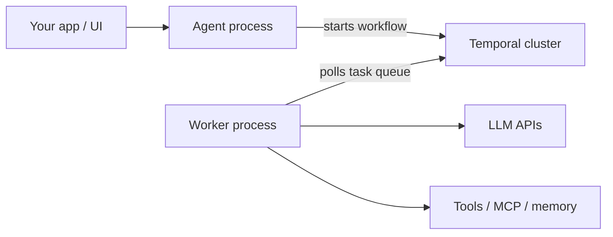

**The problem:** Your API or UI process needs to submit agent runs and stream results to users — but you don't want it to also host the Temporal worker that executes LLM calls and tools. Mixing both in one process couples your UI latency to compute load, limits independent scaling, and makes deploys riskier.

**The solution:** Split the agent client (submits runs, handles streaming and approvals in your API) and the worker (polls the task queue and executes everything else) into separate processes. Workers are stateless — Temporal holds all state — so you can scale them independently, deploy them separately, and restart them without losing in-flight runs.

## Architecture



| Process | Role |
|---|---|
| **Agent** (`NewAgent` + `DisableLocalWorker`) | Starts `Run`, `Stream`, `RunAsync`; handles approvals in your UI |
| **Worker** (`NewAgentWorker`) | Polls the task queue; executes LLM calls, tools, memory, and approvals as Temporal activities |
| **Temporal** | Durable workflow history — survives crashes and deploys |

See [Temporal runtime](/runtimes/temporal) for the full architecture diagram.

## Setup

**Worker process** — polls the task queue and executes runs:

```go
w, err := agent.NewAgentWorker(
    agent.WithTemporalConfig(&agent.TemporalConfig{
        Host: "localhost", Port: 7233,
        Namespace: "default", TaskQueue: "my-app",
    }),
    agent.WithLLMClient(llmClient),
    agent.WithSystemPrompt("You are a helpful assistant."),
)
if err != nil {
    log.Fatal(err)
}

go func() {
    if err := w.Start(ctx); err != nil {
        log.Fatal(err)
    }
}()

// On shutdown:
// w.Stop()
```

**Agent process** — starts runs without polling:

```go
a, err := agent.NewAgent(
    agent.WithTemporalConfig(&agent.TemporalConfig{
        Host: "localhost", Port: 7233,
        Namespace: "default", TaskQueue: "my-app",
    }),
    agent.WithLLMClient(llmClient),
    agent.WithSystemPrompt("You are a helpful assistant."),
    agent.DisableLocalWorker(),
)
if err != nil {
    log.Fatal(err)
}
defer a.Close()

result, err := a.Run(ctx, "Hello", nil)
```

`NewAgentWorker` requires Temporal — it cannot run with the in-process runtime alone.

## Configuration alignment

Both processes must share **identical agent configuration**:

| Must match | Why |
|---|---|
| Task queue and namespace | Worker polls what the client submits to |
| `WithInstanceId` (if set) | Derives `{TaskQueue}-{InstanceId}` on both sides |
| LLM client, system prompt, tools | Fingerprint check at activity entry |
| Tool approval policy and execution mode | Same approval semantics |
| MCP, A2A, sub-agent setup | Same tool surface for the LLM |
| Conversation backend | Redis (not in-memory) for remote workers |
| Memory config | Same store and scope settings |
| Hook group names | Fingerprint includes hook group names |
| Observability config | Same OTLP endpoint on both processes |

The SDK uses a **fingerprint** check to detect config drift between the client that started a run and the worker that executes it. Mismatches fail the run with a clear error.

[`WithDisableFingerprintCheck`](/getting-started/configuration) bypasses the check on the **agent process only** — not allowed on `NewAgentWorker`. Use as break-glass only.

## Remote workers for streaming and approvals

When using `DisableLocalWorker` with **streaming** or **approvals** across processes, also pass [`EnableRemoteWorkers()`](/getting-started/configuration) on the agent:

```go
a, _ := agent.NewAgent(
    agent.WithTemporalConfig(cfg),
    agent.WithLLMClient(llmClient),
    agent.DisableLocalWorker(),
    agent.EnableRemoteWorkers(),
    agent.WithStream(true),
)
```

This starts Temporal's remote event path for out-of-process event delivery.

**Streaming guarantees in split-process mode:**

- **Live stream is not backfilled.** Tokens and tool events are delivered as produced. If your subscriber disconnects, it may miss chunks — the agent completed successfully in Temporal, but the in-flight event stream is gone.
- **Approvals degrade gracefully.** If an approval event cannot be delivered, the run continues rather than hanging — the tool is skipped with a clear message. This is intentional for autonomous agents; for interactive scenarios, design your UX so users are not silently blocked.

## Distributed conversation and memory

In-memory conversation **fails at build time** with remote workers. Use Redis or another distributed backend on both processes:

```go
conv, _ := redis.NewRedisConversation(redis.WithAddr("localhost:6379"))
convCfg := conversation.Config{Conversation: conv, Size: 20, SaveOnIteration: true}

w, _ := agent.NewAgentWorker(/* ... */, agent.WithConversation(convCfg))
a, _ := agent.NewAgent(/* ... */, agent.DisableLocalWorker(), agent.WithConversation(convCfg))
```

See [Conversation](/features/conversation) and [Memory](/features/memory).

## Crash and restart behavior

Because every agent run is a Temporal workflow, **the worker process can crash and restart without losing a single step**. Tool calls already made are not replayed, approvals already given are not re-requested — the run resumes exactly where it left off from Temporal's recorded history.

This means:
- You do not need a single process alive for the entire run duration
- Workers can be deployed, updated, or horizontally scaled while runs are in-flight
- Kubernetes restarts and process crashes are safe — keep workers supervised and restarting

<Note>
If the **agent process** serving `Stream` crashes, the workflow continues in Temporal but your client loses the connection. Once a stream is lost, reconnecting to a specific in-flight run is not supported. For interactive apps, the recommended pattern is to block the user from sending a new prompt until the current one completes — then fetch and display the final response. For autonomous agents and batch pipelines, this is a non-issue since callers wait for completion.
</Note>

## Sub-agents

Each sub-agent typically runs on its **own task queue** with its **own worker**. Pair `NewAgentWorker` with the same options as the `NewAgent` that runs that sub-agent.

Example: [Agent Worker](/examples/agent-worker) · [Durable Agent](/examples/durable-agent).

## Example

<CardGroup cols={2}>
  <Card title="Agent Worker" icon="play" href="/examples/agent-worker" horizontal>
    Minimal split client and worker
  </Card>
  <Card title="Durable Agent" icon="shield" href="/examples/durable-agent" horizontal>
    Crash and restart walkthrough with split processes
  </Card>
</CardGroup>

## Related

<CardGroup cols={2}>

  <Card title="Temporal Runtime" icon="server" href="/runtimes/temporal" horizontal>
    Durable execution and fingerprint alignment
  </Card>

  <Card title="Multiple Agents" icon="layer-group" href="/advanced/multiple-agents" horizontal>
    Task queues and instance IDs
  </Card>
</CardGroup>
