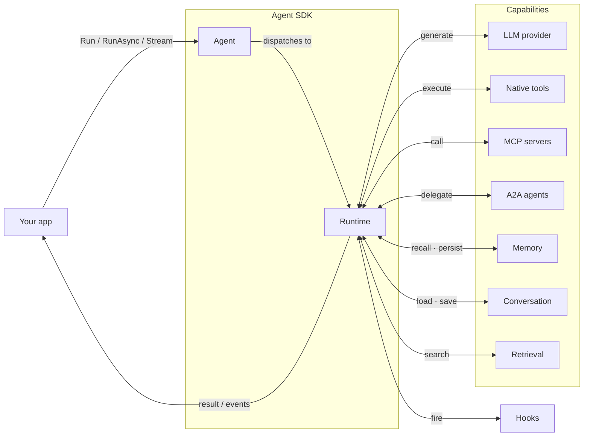
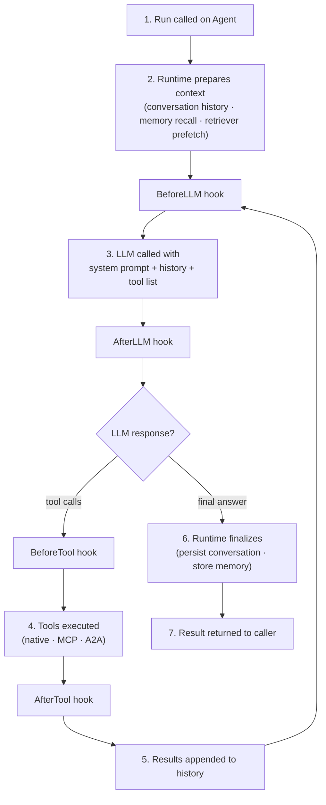
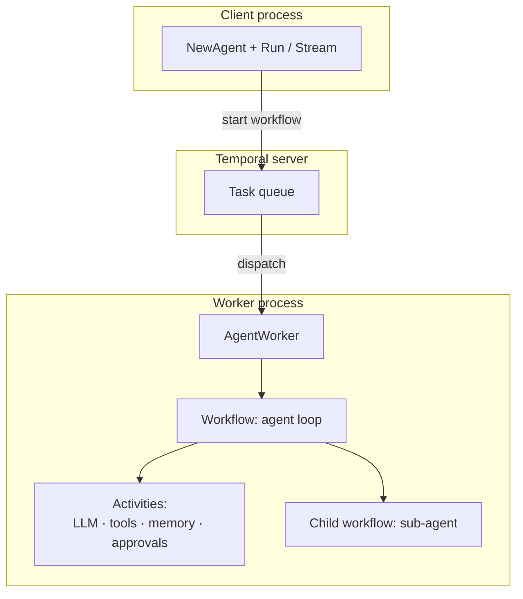

This page gives you the mental model: which components exist, how they connect, and what happens during a request. Feature details live in the individual feature pages.

## Components

**Agent** — the public handle you create with `NewAgent`. Holds the configuration and capability registries. Receives your `Run`/`Stream` call and hands it to the Runtime.

**Runtime** — executes the agent loop. Two implementations: in-process (default, no infra) and Temporal (durable, scalable). Both run the same loop; only the execution environment differs.

**Capabilities** — plugged into the Runtime at construction. Tools, MCP servers, and A2A agents form the tool surface the LLM can call. Memory, Conversation, and Retrieval shape the context the LLM receives.

**Hooks** — middleware callbacks that fire before and after LLM calls, tool execution, retrieval, and memory operations. Use them for logging, PII scrubbing, guardrails, and cost tracking without modifying agent logic. See [Hooks](/features/hooks).

## Request lifecycle

What happens from the moment your code calls `a.Run(ctx, prompt, nil)`:

Each iteration is one LLM round-trip. The loop repeats until the LLM returns a final answer or the iteration limit is reached. On `Stream`, events are emitted at each step as they happen.

## Runtimes

Run agents locally for development, or with Temporal for production-grade durability and fault tolerance. The same agent code runs on both — the SDK picks the backend based on which options you pass to `NewAgent`.

| | In-process | Temporal |
|---|---|---|
| **How it runs** | Agent loop executes in your Go process | Agent loop becomes a Temporal workflow |
| **Durability** | None — process crash loses the run | Full — Temporal replays after crashes |
| **Worker scaling** | Single process | Horizontal — multiple worker processes on the same task queue |
| **Setup** | No infra required | Requires a running Temporal server |
| **When to use** | Development, scripts, low-volume APIs | Production, long-running tasks, multi-tenant services |

Add `WithTemporalConfig` or `WithTemporalClient` to switch. Everything else stays the same.

### Temporal process topology

With Temporal, client and worker are separate concerns — the client starts workflows, the worker runs the loop:

By default `NewAgent` embeds a local worker in the same process — no separate binary needed for development. For production, split client and worker — see [Worker separation](/advanced/worker-separation).

## Related

<CardGroup cols={2}>
  <Card title="Runtimes" icon="server" href="/runtimes/overview" horizontal>
    In-process vs Temporal — full comparison
  </Card>
  <Card title="Quickstart" icon="bolt" href="/getting-started/quickstart" horizontal>
    Build and run your first agent
  </Card>
</CardGroup>
