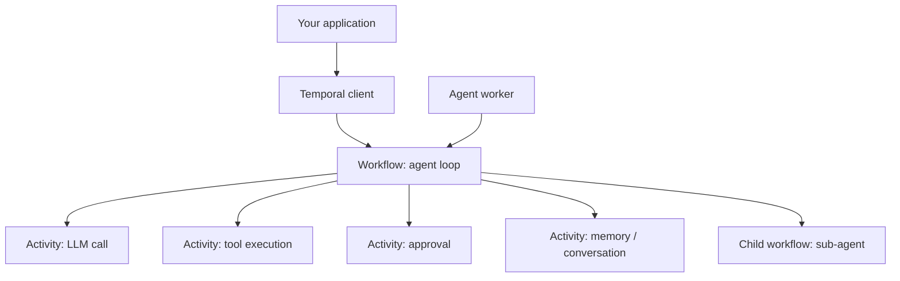

The Temporal runtime executes agent runs as **durable workflows**. Tool calls, LLM rounds, and approvals survive process crashes and deploys — Temporal replays workflow history and resumes from the last recorded step.

Enable it by passing [`WithTemporalConfig`](/getting-started/configuration) or [`WithTemporalClient`](/getting-started/configuration) to [`NewAgent`](/getting-started/quickstart). A running Temporal server or Temporal Cloud namespace is required.

## Prerequisites

**Local development** — pick one:

| Approach | Command |
|---|---|
| **Docker** | `docker run --rm -p 7233:7233 -p 8233:8233 temporalio/temporal:latest server start-dev --ip 0.0.0.0` |
| **Temporal CLI** | Install via [Set up the Temporal CLI](https://docs.temporal.io/cli/setup-cli), then `temporal server start-dev` |

Both expose gRPC at `localhost:7233` and a Web UI at http://localhost:8233.

**Production** — use [Temporal Cloud](https://docs.temporal.io/production-deployment) or a [self-hosted](https://docs.temporal.io/self-hosted-guide) cluster. Connect with `WithTemporalClient` — see the section below.

## Enable

### WithTemporalConfig (simple, local dev)

The SDK dials Temporal and manages the client lifecycle:

```go
a, err := agent.NewAgent(
    agent.WithTemporalConfig(&agent.TemporalConfig{
        Host:      "localhost",
        Port:      7233,
        Namespace: "default",
        TaskQueue: "my-app",
    }),
    agent.WithLLMClient(llmClient),
    agent.WithSystemPrompt("You are a helpful assistant."),
)
if err != nil {
    return err
}
defer a.Close()
```

| Field | Purpose |
|---|---|
| `Host` | Temporal server hostname |
| `Port` | gRPC port (default 7233) |
| `Namespace` | Temporal namespace |
| `TaskQueue` | Task queue this agent's worker polls — must be unique per agent type |

By default, `NewAgent` also starts an **embedded local worker** that polls the task queue in your process.

### WithTemporalClient (Temporal Cloud, TLS, custom options)

Use when you need mTLS, Temporal Cloud API keys, or connection options not covered by `TemporalConfig`. You create and own the Temporal client:

```go
import "go.temporal.io/sdk/client"

tc, err := client.Dial(client.Options{
    HostPort:    "namespace-id.tmprl.cloud:7233",
    Namespace:   "my-namespace",
    Credentials: client.NewAPIKeyStaticCredentials(apiKey),
})
if err != nil {
    return err
}
defer tc.Close()

a, err := agent.NewAgent(
    agent.WithTemporalClient(tc, "my-app"),  // pass taskQueue as second arg
    agent.WithLLMClient(llmClient),
    agent.WithSystemPrompt("You are a helpful assistant."),
)
```

<Warning>
Provide **either** `WithTemporalConfig` or `WithTemporalClient`, not both. The agent does not close a client passed via `WithTemporalClient` — you own its lifecycle and must call `tc.Close()` yourself.
</Warning>

See [Temporal Client example](/examples/temporal-client) for the full pattern.

## Architecture

Temporal splits agent execution into three parts:



| Component | Role |
|---|---|
| **Temporal client** | Your application uses this to start runs via `Run`, `Stream`, or `RunAsync` |
| **Workflow** | Replay-safe orchestration — the agent loop (LLM rounds, tool routing, delegation). Must stay deterministic |
| **Activities** | Side effects and I/O — LLM calls, tool execution, MCP calls, memory I/O, approval steps. Retries and timeouts apply here |
| **Worker** | Polls a task queue and executes workflow and activity code. Scale horizontally by adding workers |
| **Child workflows** | Sub-agent delegation runs as child workflows on separate task queues |

Workers are stateless — they replay and advance workflow history; Temporal holds all state.

<Note>
Very long runs automatically trigger **continue-as-new** internally — starting a fresh workflow under the same workflow ID while preserving state. This is transparent to your application code.
</Note>

## Durable execution

Because every agent run is a Temporal workflow:

- **Process crashes do not lose progress** — completed tool calls are not replayed, given approvals are not re-requested
- **Deploys are safe** — restart workers; the workflow resumes from recorded history
- **Runs outlive the client process** — the workflow continues in Temporal even if your application exits

See [Durable Agent example](/examples/durable-agent) for crash and retry scenarios.

## Split client and worker

For production, split the agent client and worker into separate processes.

**Worker process** — polls the task queue and executes runs:

```go
w, err := agent.NewAgentWorker(
    agent.WithTemporalConfig(&agent.TemporalConfig{
        Host: "localhost", Port: 7233,
        Namespace: "default", TaskQueue: "my-app",
    }),
    agent.WithLLMClient(llmClient),
)
go w.Start(ctx)
```

**Agent process** — starts runs, handles approvals and streaming in your UI:

```go
a, err := agent.NewAgent(
    agent.WithTemporalConfig(&agent.TemporalConfig{
        Host: "localhost", Port: 7233,
        Namespace: "default", TaskQueue: "my-app",
    }),
    agent.WithLLMClient(llmClient),
    agent.DisableLocalWorker(),
)
```

Both processes must share identical configuration — task queue, tools, conversation backend (Redis for remote workers), memory, approval policy, and hook groups. See [Worker separation](/advanced/worker-separation).

When using `DisableLocalWorker` with streaming or approvals across processes, also pass [`EnableRemoteWorkers()`](/getting-started/configuration).

## Streaming and approvals

The agent run (the Temporal workflow) is durable. Live stream delivery is not — incremental tokens and events are delivered as produced and are not backfilled if your client disconnects. The workflow continues in Temporal regardless; only the live event stream is lost.

See [Temporal runtime streaming](/runtimes/temporal#streaming-and-approvals) and [Approvals](/features/approvals) for full details.

## Agent mode

[`WithAgentMode`](/getting-started/configuration) tells the runtime how to treat the run. `AgentModeInteractive` (default) is for user-facing apps with short, bounded sessions. `AgentModeAutonomous` is for background jobs and long-running pipelines. See [Timeouts & Modes](/advanced/timeouts-and-modes).

## Configuration alignment

Client and worker processes must share identical configuration — task queue, tools, memory, conversation backend, approval policy, and hook groups. The SDK validates this with a fingerprint check at activity entry; a mismatch aborts the run with a clear error.

See [Worker separation](/advanced/worker-separation) for the full list and production setup guide.

## Sub-agents on Temporal

Sub-agent delegation runs as a **child workflow** on its own task queue. This is an execution model detail — the child workflow is independently durable and tracked by Temporal. See [Sub-agents](/features/sub-agents) for configuration and stream fan-in behaviour.

## Examples

<CardGroup cols={2}>
  <Card title="Durable Agent" icon="shield" href="/examples/durable-agent">
    Crash recovery and split-process durability
  </Card>
  <Card title="Agent Worker" icon="server" href="/examples/agent-worker">
    Client and worker in separate processes
  </Card>
  <Card title="Temporal Client" icon="link" href="/examples/temporal-client">
    TLS, API key auth, Temporal Cloud
  </Card>
  <Card title="Worker Separation" icon="diagram-project" href="/advanced/worker-separation">
    Production split-process patterns
  </Card>
</CardGroup>
